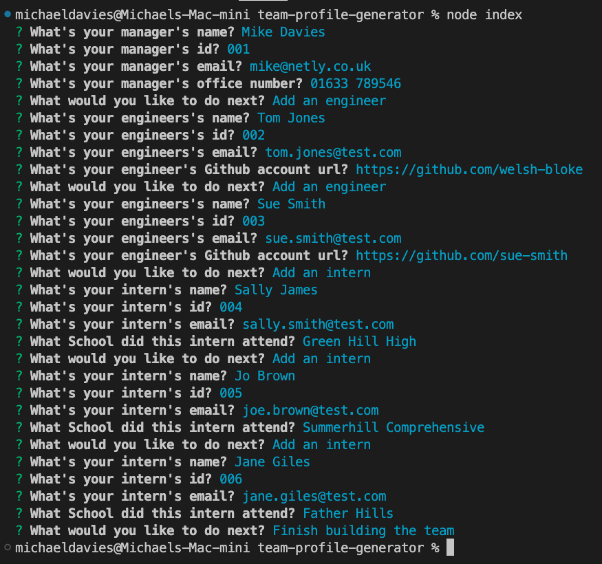
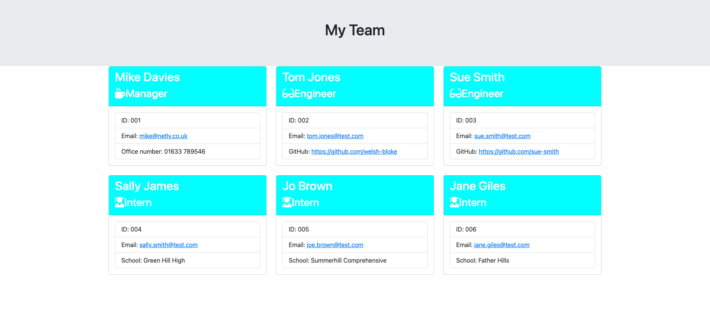
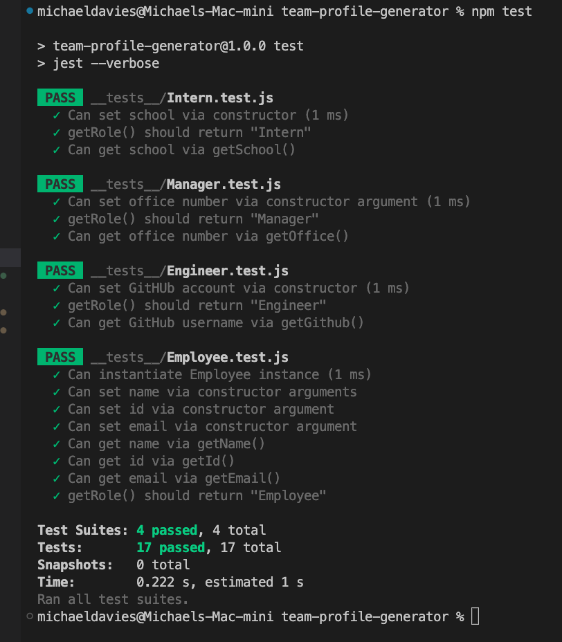

# Team Profile Generator

## Overview

The Team Profile Generator web app was created using Inquirer.js, for the purpose of generating a 'My Team' web page. It generates the page by using the terminal 
to ask series of questions. When complete, thr program generates a 'team.html page. The app asks the following questions:

* Manager Questions
    * What's your manager's name?
    * What's your manager's id?
    * What's your manager's email?
    * What's your manager's office number?
* Engineer Questions?
    * What's your engineer's name?
    * What's your engineer's id?
    * What's your engineer's email?
    * What's your engineer's Github account url?
* Intern Questions?
    * What's your intern's name?
    * What's your intern's name?
    * What's your intern's name?
    * What School did this intern attend?

After each completed secion, the user is prompted to choose one of the following actions:

* What would you like to do next?
    * Add a manager
    * Add an engineer
    * Add an intern
    * Finish building the team

## Validation

If the user tries to input an empty value, they are presented with a warning, and the question is repeated:

## Terminal Screenshots

### Terminal Questions And Answers

### HTML Output

## Sample HTML File Generated By The Application

[A sample Html file can be found here](https://github.com/welsh-bloke/team-profile-generator)

## Tests

This app has been tested usin Jest. All tests passed, see screenshot below:

## Deployment

This app was not deployed

## Usage

Open the app in a terminal and run 'node index.js

## License

This project is licensed under the MIT license.
